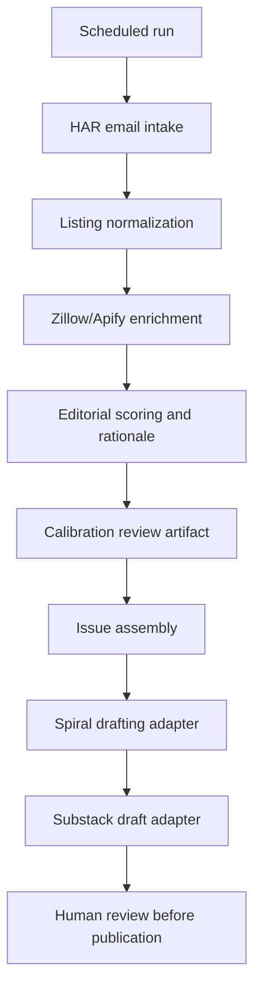

# Houston Housing Dispatch Implementation Plan

## Summary

Build Houston Housing Dispatch as a greenfield TypeScript/Node automation app with local persistent state, replaceable integration adapters, an editorial scoring pipeline, a calibration review surface, Spiral drafting handoff, and Substack draft creation that always stops before publication.

---

## Problem Frame

The origin requirements define a newsletter workflow for smart Houston homebuyers and real-estate-curious locals who want a sharp local filter on interesting listings. The implementation needs to convert HAR listing notification emails into enriched, scored, explained candidates and then produce a reviewable newsletter draft without turning the product into raw listing syndication or agent-style promotion.

The workspace currently has no application scaffold, package manifest, runtime configuration, or existing implementation patterns. This plan therefore creates the initial app structure while keeping the architecture small enough for a first working version.

---

## Requirements Trace

- R1-R3: Preserve audience and positioning in scoring, drafting prompts, and issue output.
- R4-R7: Implement the editorial filter and batch-level read as first-class pipeline outputs.
- R8-R10: Support scheduled 1-2 weekly issue runs for selected inside-the-loop neighborhoods.
- R11-R13: Implement the end-to-end automation target while stopping at a ready-to-review Substack draft.
- R14: Preserve selected and rejected candidates with rationale for editorial calibration.
- R15: Define credential handling and access control before connected-account implementation.
- AE1-AE2: Ensure scoring rejects generic listings and elevates listings with meaningful buyer-relevant angles.
- AE3: Ensure the workflow creates a draft and stops for human review.
- AE4: Ensure selected and rejected candidates remain inspectable with rationale.

---

## High-Level Technical Design

Use a small Node CLI/service that can run locally or on a scheduler. The core pipeline is domain-first and adapter-backed: email intake, enrichment, drafting, and Substack creation are replaceable adapters, while listing normalization, scoring, issue assembly, calibration records, and persistence stay under local control.

---

## Key Technical Decisions

- **TypeScript/Node first:** The named integrations are API and browser-automation shaped, and TypeScript gives enough structure for domain models without adding a heavier framework.
- **SQLite-backed local state:** A local database is enough for listing state, enrichment results, issue runs, calibration records, and draft links while keeping the first version inspectable and easy to run.
- **Adapter seams for external tools:** Gmail/HAR intake, Apify enrichment, Spiral drafting, and Substack draft creation should be isolated behind interfaces because each integration may need replacement or fallback.
- **Draft creation is publication-adjacent:** The Substack adapter must create or prepare drafts only; publication stays outside automation.
- **Calibration artifact before polished prose:** Early runs need selected and rejected candidate rationale so the editorial operator can judge the automation, not only the final draft.
- **Least-privilege credentials:** Connected-account access must be scoped to the minimum required permissions and documented before the integration units are considered complete.

---

## Implementation Units

- U1. **Project Scaffold and Configuration**

**Goal:** Create the greenfield app foundation, runtime configuration, and persistence migration path.

**Requirements:** R11, R15

**Dependencies:** None

**Files:**
- Create: `package.json`
- Create: `tsconfig.json`
- Create: `.env.example`
- Create: `src/config/index.ts`
- Create: `src/db/index.ts`
- Create: `src/db/migrations/001_initial.sql`
- Create: `src/types/domain.ts`
- Test: `tests/config.test.ts`
- Test: `tests/db.test.ts`

**Approach:**
- Set up a TypeScript Node app with a CLI entry point and test runner.
- Define typed configuration for run cadence, monitored neighborhoods, integration credentials, and local database path.
- Create the initial SQLite schema for listings, enrichment snapshots, scoring decisions, issue runs, calibration records, and draft references.
- Keep secrets out of persisted records and logs by convention from the first unit.

**Patterns to follow:**
- No existing repo patterns are present; keep modules plain and dependency-light.

**Test scenarios:**
- Happy path: loading a complete local environment produces typed configuration.
- Edge case: missing optional integration credentials keeps fallback adapters available.
- Error path: missing required local database configuration fails with a clear configuration error.
- Integration: applying initial migrations creates all expected tables in a temporary database.

**Verification:**
- The project can install, typecheck, run tests, and initialize an empty local database.

---

- U2. **HAR Email Intake and Listing Normalization**

**Goal:** Pull candidate listing notifications from the monitored mailbox and normalize them into listing records.

**Requirements:** R9, R11, R15

**Dependencies:** U1, U8 for real mailbox credentials; mocked intake can proceed after U1.

**Files:**
- Create: `src/integrations/gmail/client.ts`
- Create: `src/intake/harEmailParser.ts`
- Create: `src/intake/listingNormalizer.ts`
- Create: `src/intake/runIntake.ts`
- Test: `tests/harEmailParser.test.ts`
- Test: `tests/listingNormalizer.test.ts`
- Test: `tests/gmailClient.contract.test.ts`

**Approach:**
- Use Gmail message listing and retrieval for the initial implementation; keep Gmail push notifications as a follow-up option if polling is sufficient.
- Filter messages by sender, label, or query configured for the dedicated HAR notification mailbox.
- Parse listing URLs, address, price, neighborhood, basic specs, and source metadata from notification emails.
- Deduplicate listings by stable listing URL or listing ID when available.
- Store raw source references and normalized fields needed for enrichment and scoring.

**Patterns to follow:**
- Gmail API docs for listing messages and fetching message details.

**Test scenarios:**
- Happy path: a representative HAR notification email produces one normalized candidate listing.
- Edge case: a duplicate email updates source metadata without creating a duplicate listing.
- Edge case: an email with multiple candidate links creates multiple candidates when links are distinct.
- Error path: malformed email content is recorded as an intake parse failure without stopping the run.
- Integration: Gmail client can list messages by configured query using a mocked Gmail API response.

**Verification:**
- A dry run can ingest fixture emails into the local database with repeatable deduplication.

---

- U3. **Zillow/Apify Enrichment Adapter**

**Goal:** Enrich normalized listings with additional property details through the Zillow Details Scraper or an equivalent Apify actor.

**Requirements:** R4, R5, R11, R15

**Dependencies:** U1, U2, U8 for real Apify credentials; mocked enrichment can proceed after U1 and U2.

**Files:**
- Create: `src/integrations/apify/client.ts`
- Create: `src/enrichment/enrichmentAdapter.ts`
- Create: `src/enrichment/zillowDetailsMapper.ts`
- Create: `src/enrichment/runEnrichment.ts`
- Test: `tests/zillowDetailsMapper.test.ts`
- Test: `tests/enrichmentAdapter.test.ts`
- Test: `tests/apifyClient.contract.test.ts`

**Approach:**
- Wrap Apify actor execution and dataset retrieval behind an enrichment adapter.
- Store each enrichment response as a versioned snapshot so scoring can be audited later.
- Map actor output into normalized fields used by editorial scoring: price, size, lot, property type, year built, location, photos/links metadata, description, and listing status when available.
- Treat actor failures as retryable per listing rather than failing the entire issue run.

**Patterns to follow:**
- Apify Actor run and dataset retrieval API/client patterns.

**Test scenarios:**
- Happy path: actor result maps into a normalized enrichment snapshot.
- Edge case: missing lot size or year built leaves null fields without breaking scoring.
- Error path: actor timeout records a failed enrichment state and leaves the listing eligible for retry.
- Error path: malformed actor output is rejected with a validation error attached to that listing.
- Integration: mocked Apify run returns a dataset ID and dataset items are persisted.

**Verification:**
- Enriched fixture listings include enough data for scoring without losing source provenance.

---

- U4. **Editorial Scoring and Rationale Engine**

**Goal:** Score enriched listings against the Dispatch definition of interesting and produce buyer-relevant rationale.

**Requirements:** R1-R7, R10, R14, AE1, AE2

**Dependencies:** U1, U2, U3

**Files:**
- Create: `src/editorial/scoringRules.ts`
- Create: `src/editorial/rationaleBuilder.ts`
- Create: `src/editorial/candidateSelector.ts`
- Create: `src/editorial/marketBatchSummary.ts`
- Test: `tests/scoringRules.test.ts`
- Test: `tests/rationaleBuilder.test.ts`
- Test: `tests/candidateSelector.test.ts`

**Approach:**
- Encode the editorial inclusion dimensions from the requirements: rarity, value mismatch, character, tradeoff, location-specific hook, and buyer-usefulness.
- Produce structured rationale for both selected and rejected candidates.
- Keep scoring deterministic and inspectable first; use LLM assistance only for summarizing or phrasing after the structured rationale exists.
- Select a ranked set of candidates for issue assembly while preserving rejected candidates for calibration.

**Patterns to follow:**
- The origin requirements' "smart buyer would pause here" test.

**Test scenarios:**
- Happy path: a listing with a rare lot and meaningful tradeoff receives selected rationale.
- Happy path: an older inside-the-loop home with buyer-relevant tension is eligible for inclusion.
- Edge case: a generic new-build townhome with no pricing edge or location hook is rejected.
- Edge case: a listing with incomplete enrichment can still be scored when enough source fields exist.
- Error path: scoring rejects candidates whose required identity fields are missing.

**Verification:**
- Fixture-based scoring explains why candidates were selected or rejected in terms an editorial operator can audit.

---

- U5. **Issue Run Assembly and Calibration Review**

**Goal:** Create issue runs that preserve selected/rejected candidates, rationale, and batch-level market read before drafting.

**Requirements:** R7, R10, R13, R14, AE3, AE4

**Dependencies:** U1, U4

**Files:**
- Create: `src/issues/issueAssembler.ts`
- Create: `src/issues/calibrationReport.ts`
- Create: `src/issues/runIssue.ts`
- Create: `src/output/templates/calibration-report.md`
- Test: `tests/issueAssembler.test.ts`
- Test: `tests/calibrationReport.test.ts`

**Approach:**
- Create an issue run from the latest eligible scored candidates for configured neighborhoods.
- Persist selected and rejected candidate sets with their rationale.
- Generate a local calibration report that the editorial operator can inspect before or alongside the generated draft.
- Include a batch-level summary input for Spiral that describes what the listings say about Houston housing this week.

**Patterns to follow:**
- Keep the calibration artifact separate from the final reader-facing newsletter draft.

**Test scenarios:**
- Happy path: an issue run stores selected candidates, rejected candidates, and rationale.
- Happy path: calibration report includes source links, scores, and rationale for selected and rejected listings.
- Edge case: candidates from neighborhoods outside configuration are excluded from the issue run.
- Error path: issue assembly fails clearly when no scored candidates exist for the configured run.
- Integration: generated calibration markdown links back to stored listing and enrichment records.

**Verification:**
- A complete dry run produces a calibration report an operator can use to evaluate automated selection quality.

---

- U6. **Spiral Drafting Adapter**

**Goal:** Convert issue-run data into a newsletter draft using Spiral when available, with a manual/export fallback.

**Requirements:** R1-R3, R7, R10, R11, R13

**Dependencies:** U5, U8 for real Spiral credentials; manual/export fallback can proceed after U5.

**Files:**
- Create: `src/integrations/spiral/adapter.ts`
- Create: `src/drafting/draftPromptBuilder.ts`
- Create: `src/drafting/newsletterDraft.ts`
- Create: `src/output/templates/spiral-input.md`
- Test: `tests/draftPromptBuilder.test.ts`
- Test: `tests/newsletterDraft.test.ts`

**Approach:**
- Build a drafting input that includes selected listings, buyer-relevant rationale, batch-level market read, and voice constraints.
- If Spiral exposes a stable automation path, call it through the adapter.
- If Spiral automation is unavailable or unreliable, export a structured Spiral input artifact for manual use and re-import the resulting draft text.
- Store draft text and source issue-run references before Substack handoff.

**Patterns to follow:**
- Preserve the origin doc's voice: sharp local filter, taste plus practicality, not agent puffery.

**Test scenarios:**
- Happy path: selected candidates produce a structured Spiral input.
- Happy path: a returned draft is stored against the issue run.
- Edge case: Spiral unavailable creates a manual handoff artifact instead of failing the whole run.
- Error path: draft output missing required listing sections is rejected before Substack handoff.

**Verification:**
- The workflow can produce a reviewable newsletter draft with or without direct Spiral automation.

---

- U7. **Substack Draft Adapter**

**Goal:** Create or prepare a Substack draft while keeping publication outside automation.

**Requirements:** R11, R12, R13, R15, AE3

**Dependencies:** U6, U8 for real Substack credentials or session access; manual handoff fallback can proceed after U6.

**Files:**
- Create: `src/integrations/substack/adapter.ts`
- Create: `src/publishing/substackDraft.ts`
- Create: `src/publishing/publicationGuard.ts`
- Test: `tests/substackDraft.test.ts`
- Test: `tests/publicationGuard.test.ts`

**Approach:**
- First validate whether a supported Substack draft creation route is available for the publication.
- If only browser/session automation is possible, isolate it behind the Substack adapter and keep it replaceable.
- Ensure the adapter can create or prepare a draft but cannot publish.
- Store the resulting draft URL or fallback artifact path on the issue run.

**Patterns to follow:**
- Substack's public support docs describe web-editor draft creation and automatic draft saving, but not a stable public draft API.

**Test scenarios:**
- Happy path: draft text creates a stored draft reference through a mocked supported adapter.
- Edge case: unsupported Substack automation produces a local publish-ready artifact for manual copy.
- Error path: any attempt to call a publish action is blocked by the publication guard.
- Error path: adapter failure leaves the issue run in a reviewable failed-handoff state.

**Verification:**
- A completed issue run ends with either a Substack draft reference or a manual handoff artifact, never an automatically published post.

---

- U8. **Credential, Access-Control, and Operational Guardrails**

**Goal:** Define and enforce least-privilege access expectations for all connected accounts and local operators.

**Requirements:** R12, R13, R15

**Dependencies:** U1

**Files:**
- Create: `src/security/secretPolicy.ts`
- Create: `src/security/redaction.ts`
- Create: `src/security/operatorAccess.ts`
- Create: `docs/operations/credentials-and-access.md`
- Test: `tests/redaction.test.ts`
- Test: `tests/operatorAccess.test.ts`

**Approach:**
- Document required credentials, scopes, owners, rotation expectations, and dev/prod separation.
- Implement log redaction for tokens, mailbox content snippets, session cookies, and generated draft payloads where applicable.
- Define who can run the workflow, administer integrations, and access draft creation credentials.
- Explicitly state whether the Substack automation account has publish capability disabled technically or only procedurally.
- Treat this as an early cross-cutting unit: mocked integration work can begin before it, but real connected-account usage should wait for it.

**Patterns to follow:**
- Least-privilege by default; publication-adjacent credentials are treated as sensitive.

**Test scenarios:**
- Happy path: allowed operator can run a local workflow command.
- Error path: unauthorized operator access is rejected when access control is enabled.
- Error path: logs redact configured secret-like values and session tokens.
- Integration: credential documentation lists every adapter credential used by the app.

**Verification:**
- Implementation cannot be considered complete until credential/access documentation exists and tests cover redaction and operator checks.

---

- U9. **CLI Orchestration and Scheduling Entry Points**

**Goal:** Wire the units into a runnable workflow for intake, enrichment, scoring, drafting, and draft handoff.

**Requirements:** R8, R9, R11-R14

**Dependencies:** U1-U8

**Files:**
- Create: `src/cli.ts`
- Create: `src/workflows/runDispatch.ts`
- Create: `src/workflows/dryRun.ts`
- Create: `docs/operations/running-the-dispatch.md`
- Test: `tests/runDispatch.test.ts`
- Test: `tests/dryRun.test.ts`

**Approach:**
- Provide commands for intake-only, enrich-only, score-only, issue dry run, and full dispatch draft run.
- Make dry runs safe by preventing Substack draft creation and writing local artifacts only.
- Keep scheduling external at first through the host environment or a simple cron runner documented in operations notes.
- Summarize run results with counts for ingested, enriched, selected, rejected, drafted, and handoff status.

**Patterns to follow:**
- CLI-first orchestration keeps the first version observable and scheduler-agnostic.

**Test scenarios:**
- Happy path: full workflow processes fixture data through draft handoff with mocked integrations.
- Happy path: dry run produces calibration and draft artifacts without touching Substack.
- Edge case: rerunning the same intake data does not duplicate listings.
- Error path: enrichment failure for one listing does not prevent other candidates from being scored.
- Error path: missing required credentials disables only the affected integration command.

**Verification:**
- An operator can run the workflow locally and inspect artifacts before enabling recurring execution.

---

## System-Wide Impact

- **Interaction graph:** CLI commands orchestrate domain services and integration adapters; external services remain behind replaceable boundaries.
- **Error propagation:** Per-listing errors should be recorded on listing or issue-run records; run-level errors should summarize which stage failed and which artifacts remain inspectable.
- **State lifecycle risks:** Deduplication, enrichment retries, and draft handoff status must be idempotent enough for repeated scheduled runs.
- **API surface parity:** Dry-run and full-run commands should share the same domain pipeline until the final Substack handoff.
- **Integration coverage:** Unit tests are not enough; mocked end-to-end runs should prove the pipeline can move fixture data through intake, enrichment, scoring, calibration, drafting, and draft handoff.
- **Unchanged invariants:** Automation must never publish directly to Substack and must not bypass the human review boundary.

---

## Scope Boundaries

- Direct Substack publication remains out of scope.
- Houston suburbs, broader content formats, neighborhood guides, and first-time-buyer education remain out of scope.
- Audience acquisition and validation thresholds remain out of scope because they were explicitly skipped during requirements review.
- HAR coverage checks and no-publish fallback policy remain out of scope because they were explicitly skipped during requirements review.
- A polished public reader-facing website is out of scope for the first implementation.

### Deferred to Follow-Up Work

- Gmail push notifications through Pub/Sub if polling proves insufficient.
- A web dashboard for candidate review if markdown/local artifacts are not enough.
- A stronger publication-safety/compliance review gate if the workflow begins copying source media or text rather than linking and summarizing.
- Suburb expansion once the inside-the-loop workflow is validated.

---

## Risks & Dependencies

| Risk | Mitigation |
|------|------------|
| Substack lacks a stable public draft API | Isolate Substack behind an adapter and support a manual handoff artifact if browser/session automation is not acceptable. |
| Spiral automation path is unavailable or unstable | Produce a structured Spiral input artifact and allow manual draft import. |
| Apify actor output changes | Validate and version enrichment snapshots; keep mapper tests based on saved fixtures. |
| Gmail/HAR email formats change | Keep parser fixture-driven and record parse failures without stopping the full run. |
| Automated scoring feels plausible but wrong | Preserve selected and rejected candidates with rationale for calibration. |
| Credentials leak through logs or local files | Add redaction tests, `.env.example`, least-privilege documentation, and avoid storing secret values in the database. |

---

## Documentation / Operational Notes

- Create `docs/operations/running-the-dispatch.md` with setup, dry-run, full-run, and scheduler guidance.
- Create `docs/operations/credentials-and-access.md` before enabling real connected accounts.
- Keep fixture data free of real private mailbox content unless explicitly sanitized.
- Use mocked integrations for default tests; real integration checks should be opt-in.

---

## Sources & References

- **Origin document:** `docs/brainstorms/houston-housing-dispatch-requirements.md`
- Gmail API message listing: https://developers.google.com/workspace/gmail/api/guides/list-messages
- Gmail API mailbox watch: https://developers.google.com/workspace/gmail/api/reference/rest/v1/users/watch
- Gmail API message resource: https://developers.google.com/workspace/gmail/api/reference/rest/v1/users.messages
- Apify Actors overview: https://docs.apify.com/platform/actors
- Apify API getting started: https://docs.apify.com/api/v2/getting-started
- Apify Run Actor endpoint: https://docs.apify.com/api/v2/act-runs-post
- Substack draft/editor support: https://support.substack.com/hc/en-us/articles/360037831771-How-do-I-publish-a-new-post-on-Substack
